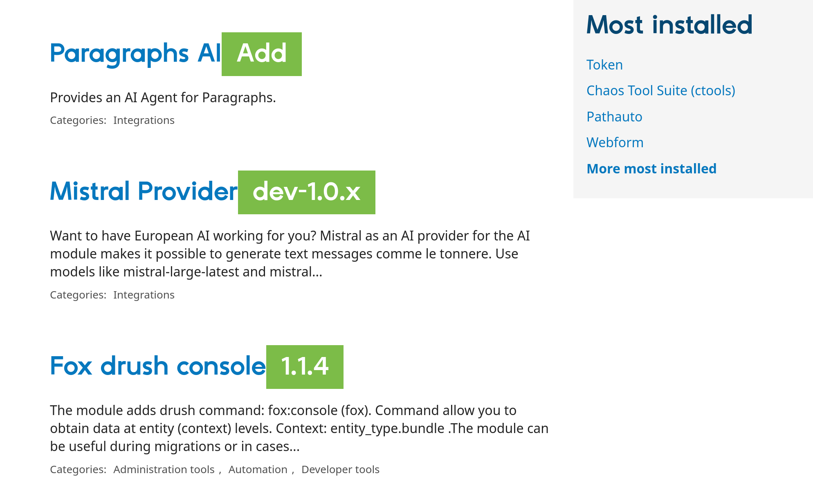

# Drupal Extension

A web extension for discovering Drupal modules.

## How it works

Starting the project in dev mode opens Firefox to the Drupal.org module listing page, sorted by latest release.

The composer.json file from your project is parsed to find modules that are already installed.

When the module listing page is loaded, each module link is checked to see if the module exists.

If not, an add button is provided.

Clicking on the add button generates a composer command that you can copy and paste into your terminal.

Currently, this only works per page.

## TODO

Provide a better way to configure composer file path (currently hardcoded).
